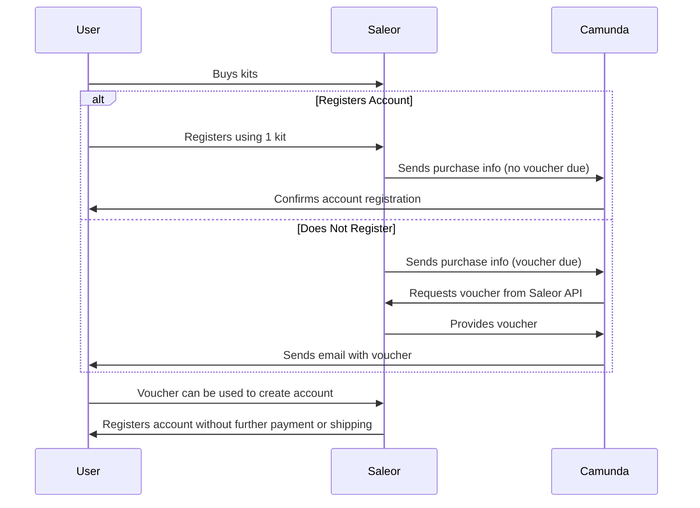

1. **Purchase Requirement for Account Creation**: To create an account users must either purchase a kit or have a voucher.

2. **Gift Cards and Purchases**: Saleor, which supports gift cards, allows users to make purchases without having an account.

3. **Voucher Distribution Based on Purchases**:
   - If a user buys a kit and registers for an account, they receive no voucher because their kit is used for the account creation.
   - If a user buys a kit but does not register, they receive a voucher.
   - If a user buys multiple kits and registers for an account using one of them, they receive vouchers for the remaining kits (e.g., buys 5 kits, registers 1 account, receives 4 vouchers).

4. **Role of Camunda**:
   - When a purchase is made, the user’s email (with order details) is sent from Saleor to Camunda, not directly to the user.
   - Camunda checks if the user is due any vouchers and, if so, how many.
   - Camunda then requests these vouchers from the Saleor API and sends them in an email to the user.

5. **Role of Saleor**:
   - Saleor ensures that no account can be created without a purchase or a voucher.
   - If a user tries to register using a voucher, Saleor handles this without triggering any shipping or payment processes because the voucher is for account creation, not a physical product. Simply configure this to Saleor.

